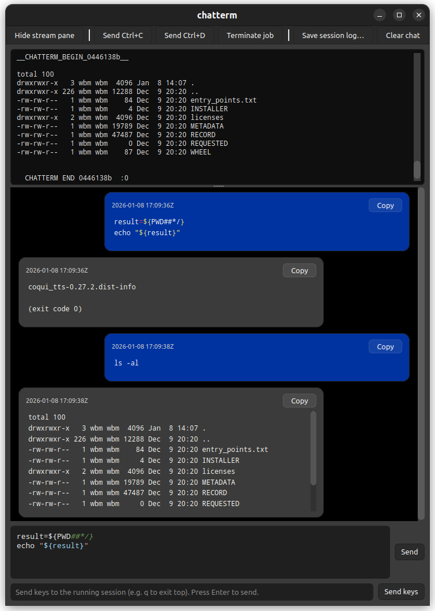

# chatterm

This programme is a two-pane GUI terminal which runs terminal commands from chat-style input and captures outputs, with inputs and outputs represented in timestamped, copyable message bubbles, with session logging and basic syntax highlighting.



## setup

```Bash
python3 -m pip install --user pygments PySide6
```
